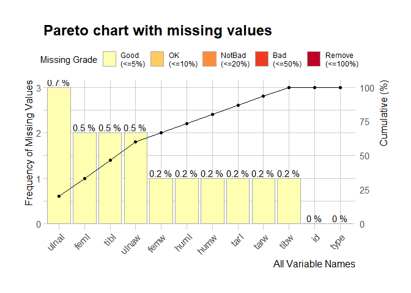
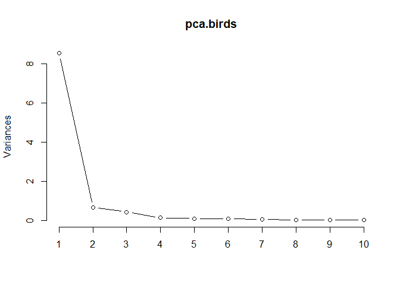
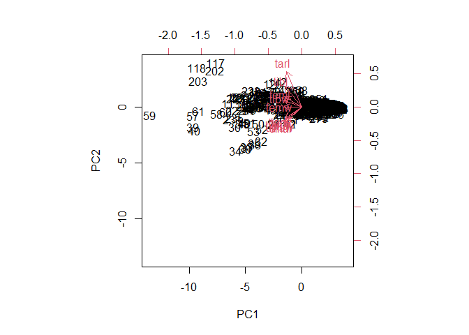
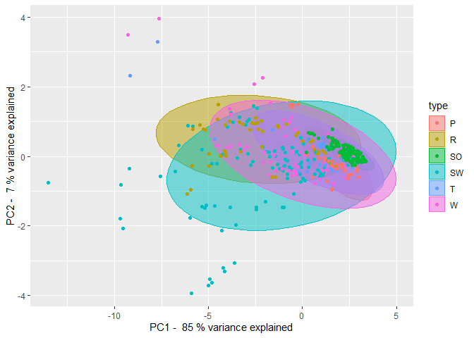

The current markdown describes Principal Component Analysis (PCA) on the
dataset: Measurement of bones and ecological group of birds, available
in
[Kaggle](https://www.kaggle.com/zhangjuefei/birds-bones-and-living-habits)

In total, there are 6 ecological groups and 10 measurements to represent
each bird.

### Ecological Group

-   Swimming Birds
-   Wading Birds
-   Terrestrial Birds
-   Raptors
-   Scansorial Birds
-   Singing Birds

### Measurement variables

-   Length and Diameter of Humerus (huml, humw)
-   Length and Diameter of Ulna (ulnal, ulnaw)
-   Length and Diameter of Femur (feml, femw)
-   Length and Diameter of Tibiotarsus (tibl, tibw)
-   Length and Diameter of Tarsometatarsus (tarl, tarw)

``` r
library(dlookr)
```

    ## Warning: package 'dlookr' was built under R version 4.1.1

    ## Either Arial Narrow or Liberation Sans Narrow fonts are required to Viz.
    ## Please use dlookr::import_liberation() to install Liberation Sans Narrow font.

    ## 
    ## Attaching package: 'dlookr'

    ## The following object is masked from 'package:base':
    ## 
    ##     transform

``` r
library(ggplot2)
library(psych)
```

    ## Warning: package 'psych' was built under R version 4.1.2

    ## 
    ## Attaching package: 'psych'

    ## The following objects are masked from 'package:ggplot2':
    ## 
    ##     %+%, alpha

    ## The following object is masked from 'package:dlookr':
    ## 
    ##     describe

``` r
library(imputeTS)
```

    ## Warning: package 'imputeTS' was built under R version 4.1.2

    ## Registered S3 method overwritten by 'quantmod':
    ##   method            from
    ##   as.zoo.data.frame zoo

``` r
birds <- read.csv("bird.csv", header=TRUE)
head(birds)
```

    ##   id  huml humw ulnal ulnaw  feml femw  tibl tibw  tarl tarw type
    ## 1  0 80.78 6.68 72.01  4.88 41.81 3.70  5.50 4.03 38.70 3.84   SW
    ## 2  1 88.91 6.63 80.53  5.59 47.04 4.30 80.22 4.51 41.50 4.01   SW
    ## 3  2 79.97 6.37 69.26  5.28 43.07 3.90 75.35 4.04 38.31 3.34   SW
    ## 4  3 77.65 5.70 65.76  4.77 40.04 3.52 69.17 3.40 35.78 3.41   SW
    ## 5  4 62.80 4.84 52.09  3.73 33.95 2.72 56.27 2.96 31.88 3.13   SW
    ## 6  5 61.92 4.78 50.46  3.47 49.52 4.41 56.95 2.73 29.07 2.83   SW

``` r
summary(birds)
```

    ##        id             huml             humw            ulnal       
    ##  Min.   :  0.0   Min.   :  9.85   Min.   : 1.140   Min.   : 14.09  
    ##  1st Qu.:104.8   1st Qu.: 25.17   1st Qu.: 2.190   1st Qu.: 28.05  
    ##  Median :209.5   Median : 44.18   Median : 3.500   Median : 43.71  
    ##  Mean   :209.5   Mean   : 64.65   Mean   : 4.371   Mean   : 69.12  
    ##  3rd Qu.:314.2   3rd Qu.: 90.31   3rd Qu.: 5.810   3rd Qu.: 97.52  
    ##  Max.   :419.0   Max.   :420.00   Max.   :17.840   Max.   :422.00  
    ##                  NA's   :1        NA's   :1        NA's   :3       
    ##      ulnaw             feml             femw             tibl       
    ##  Min.   : 1.000   Min.   : 11.83   Min.   : 0.930   Min.   :  5.50  
    ##  1st Qu.: 1.870   1st Qu.: 21.30   1st Qu.: 1.715   1st Qu.: 36.42  
    ##  Median : 2.945   Median : 31.13   Median : 2.520   Median : 52.12  
    ##  Mean   : 3.597   Mean   : 36.87   Mean   : 3.221   Mean   : 64.66  
    ##  3rd Qu.: 4.770   3rd Qu.: 47.12   3rd Qu.: 4.135   3rd Qu.: 82.87  
    ##  Max.   :12.000   Max.   :117.07   Max.   :11.640   Max.   :240.00  
    ##  NA's   :2        NA's   :2        NA's   :1        NA's   :2       
    ##       tibw             tarl             tarw            type          
    ##  Min.   : 0.870   Min.   :  7.77   Min.   : 0.660   Length:420        
    ##  1st Qu.: 1.565   1st Qu.: 23.04   1st Qu.: 1.425   Class :character  
    ##  Median : 2.490   Median : 31.74   Median : 2.230   Mode  :character  
    ##  Mean   : 3.182   Mean   : 39.23   Mean   : 2.930                     
    ##  3rd Qu.: 4.255   3rd Qu.: 50.25   3rd Qu.: 3.500                     
    ##  Max.   :11.030   Max.   :175.00   Max.   :14.090                     
    ##  NA's   :1        NA's   :1        NA's   :1

``` r
birds$type<-as.factor(birds$type)
```

### Addressing missing values

If you get the below error, it is likely that you have missing values in
your data.

> Error in svd(x, nu = 0, nv = k) : infinite or missing values in ‘x’

A pareto chat is created to visualize the missing values and address
them.

``` r
plot_na_pareto(birds)
```



You could use multiple ways to address the missing values. Machine
learning methods such as MICE, rpart could be used. In this scenario, I
am addressing them simply by removing them which is not recommended at
all times. I will address this aspect with other methods and draw
comparison in future iterations.

``` r
#Handling of missing values, substitution with mean
birds <- na.omit(birds)
dims.birds <- birds[,2:11]
#dims.birds <- na_mean(dims.birds)
```

### Tests to determine appropriateness of the dataset for PCA

``` r
KMO(dims.birds)
```

    ## Kaiser-Meyer-Olkin factor adequacy
    ## Call: KMO(r = dims.birds)
    ## Overall MSA =  0.87
    ## MSA for each item = 
    ##  huml  humw ulnal ulnaw  feml  femw  tibl  tibw  tarl  tarw 
    ##  0.80  0.91  0.81  0.95  0.92  0.85  0.88  0.85  0.83  0.95

The KMO seems to be above 0.80 (meritorius : Kaiser, H. F., & Rice, J.
(1974). Little jiffy, mark IV. Educational and psychological
measurement, 34(1), 111-117. ) for all values denoting the data is great
for PCA and factor analysis.

``` r
bartlett.test(dims.birds) #multiple variances
```

    ## 
    ##  Bartlett test of homogeneity of variances
    ## 
    ## data:  dims.birds
    ## Bartlett's K-squared = 9878.7, df = 9, p-value < 2.2e-16

The Bartlett test of homegenity of variances for multiple variances
shows a significant result (p\<0.05), indicating appropriateness of the
dataset for PCA; rejection of null hypothesis - correlation matrix is an
identity matrix.

### Plotting a scree plot

Showcases the graph between eigen values and components

``` r
pca.birds <- prcomp(dims.birds, scale=TRUE)
plot(pca.birds, type="l")
```



### Summary values

``` r
summary.birds<-summary(pca.birds)
summary.birds
```

    ## Importance of components:
    ##                           PC1     PC2     PC3     PC4     PC5     PC6     PC7
    ## Standard deviation     2.9228 0.80950 0.65251 0.35234 0.30076 0.26559 0.19060
    ## Proportion of Variance 0.8543 0.06553 0.04258 0.01241 0.00905 0.00705 0.00363
    ## Cumulative Proportion  0.8543 0.91981 0.96238 0.97480 0.98384 0.99090 0.99453
    ##                            PC8    PC9    PC10
    ## Standard deviation     0.16860 0.1378 0.08525
    ## Proportion of Variance 0.00284 0.0019 0.00073
    ## Cumulative Proportion  0.99737 0.9993 1.00000

### Biplot

Biplot showcases the PC scores with the loadings of variables

``` r
final.birds<- cbind(birds, pca.birds$x[,1:2])
biplot(pca.birds, scale=0)
```



### Plotting the confidence ellipses and variance explained

``` r
final.birds %>%
  ggplot(aes(PC1, PC2, col=type, fill=type))+
  stat_ellipse(geom = "polygon", alpha=0.5)+
  geom_point()+
  xlab(paste('PC1 - ',round(summary.birds$importance[2,1],2)*100, '% variance explained'))+
  ylab(paste('PC2 - ',round(summary.birds$importance[2,2],2)*100,'% variance explained'))
```


